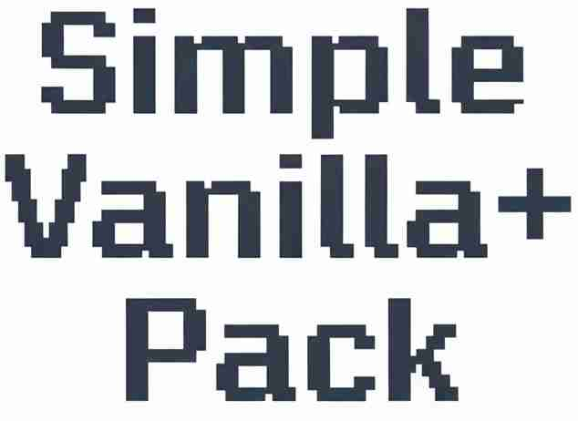

# Simple Vanilla+ Pack

Ultra-light, 100 % vanilla-faithful modpack that keeps Minecraft exactly as you know it. No heavy mods, no extra mechanics—just faster performance and a handful of quality-of-life tweaks (zoom, litemertica, dynamic lights, etc.). Includes mods that also supports building, redstones, etc.

Simple Vanilla+ is just lightweight gameplay and richer functions for building, readstone, or even if you want a modpack that still preserve the feeling of vanilla.

Under the hood you get the optimization stack going: Sodium, Lithium, ImmediatelyFast, EntityCulling, Dynamic FPS and more, all ready to shave off frame drops without touching visuals. No clutter, no new ores, no forced “tech” trees.

What you will notice are the tools that make placing blocks fun again. Litematica lets you save, share and paste huge schematics in seconds; WorldEdit hands you a wand for continent-scale edits; and the included XK Redstone Display resource pack paints power levels right on the dust so red-stone wiring finally makes sense at a glance.

Everything else—MiniHUD, Xaero maps, Tweakeroo, Jade—waits to enhance your gameplay. The pack is tiny, starts in moments, and uninstalls cleanly, leaving vanilla worlds untouched. Grab it when you want the game to feel like Mojang optimized it themselves with extra powerful functionalities, then build as big as your imagination allows.